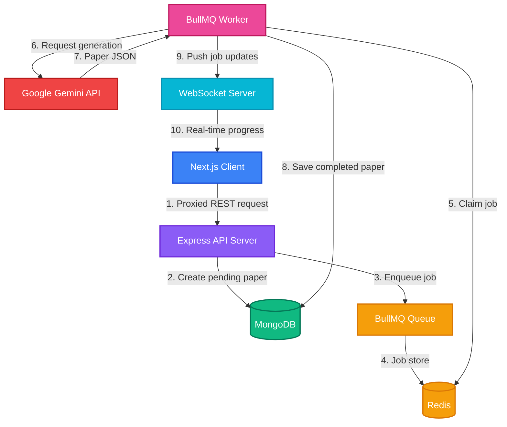
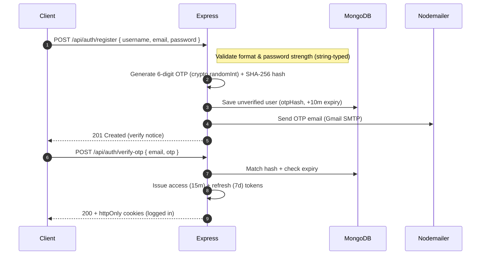
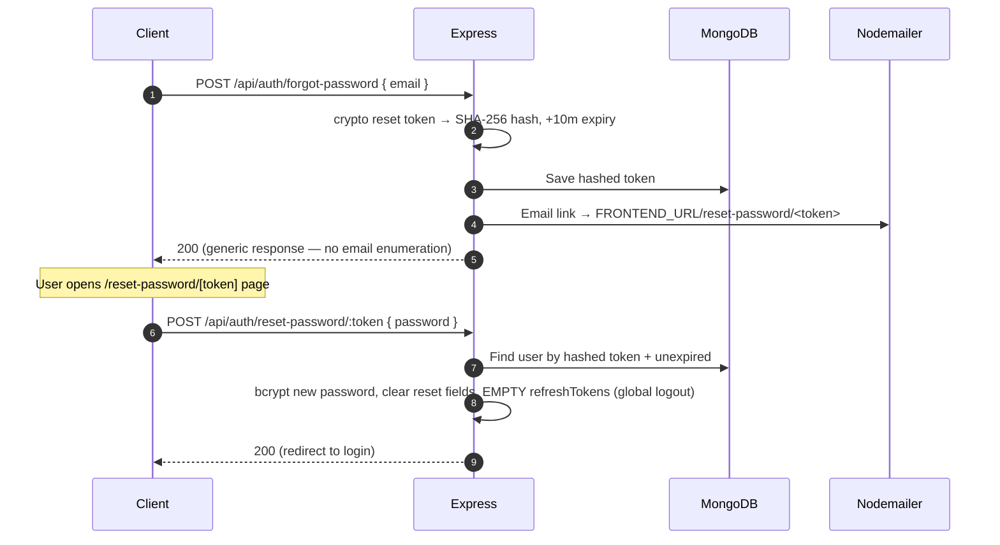
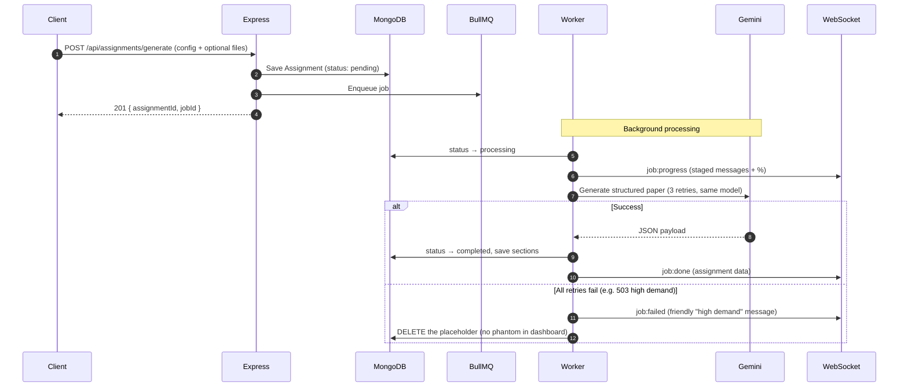

# 🌌 Lumina AI — Fullstack Architecture & Developer Guide

**Lumina AI** is a smart classroom companion for teachers. It generates fully‑formatted, customized **exam question papers** and **assignments** from a few parameters (and optional reference files) using **Google Gemini**, then helps teachers **organize classes into groups**, keep a **searchable library** of generated papers, and use an **AI Teacher's Toolkit** (lesson plans, rubrics, concept explainers, quizzes).

This document is the single source of truth for the codebase. It explains **what each part does, why it exists, and how the pieces fit together** so any developer can get productive quickly.

> **Naming note:** The product/brand is **Lumina AI**. The repository is a **monorepo** with two folders: `frontend/` (the Next.js app) and `backend/` (the Express API).

---

## 📑 Table of Contents

1. [Feature Overview](#-feature-overview)
2. [Tech Stack](#-tech-stack)
3. [Monorepo Structure](#-monorepo-structure)
4. [System Architecture & Data Flow](#-system-architecture--data-flow)
5. [Repository Layout (file‑by‑file)](#-repository-layout-fileby-file)
6. [Data Models](#-data-models)
7. [Core Flows](#-core-flows)
8. [Real‑time WebSocket Protocol](#-real-time-websocket-protocol)
9. [AI Generation & Resilience](#-ai-generation--resilience)
10. [Frontend Application](#-frontend-application)
11. [Security Measures](#-security-measures)
12. [Cookie & Token Architecture](#-cookie--token-architecture)
13. [Environment Variables](#-environment-variables)
14. [Local Setup](#-local-setup)
15. [Containerized Setup (Docker)](#-containerized-setup-docker)
16. [API Reference](#-api-reference)
17. [NPM Scripts](#-npm-scripts)
18. [Production & Deployment Notes](#-production--deployment-notes)
19. [Troubleshooting](#-troubleshooting)

---

## ✨ Feature Overview

| Area | What it does |
|---|---|
| **Authentication** | Email + password registration with **OTP email verification**, login, silent token refresh, logout, and a full **forgot/reset password** flow. |
| **AI Question Papers** | Configure title, subject, difficulty, time limit, and per‑type question rows (count + marks). Optionally upload reference files. A background job calls Gemini and returns a structured, sectioned paper. |
| **Real‑time progress** | The browser receives live `job:progress` / `job:done` / `job:failed` events over an authenticated WebSocket. |
| **AI Teacher's Toolkit** | Synchronous AI helpers: **Lesson Plan**, **Rubric Generator**, **Concept Explainer**, **Quiz from Notes** — each returns Markdown you can copy/download. |
| **My Groups** | CRUD for student groups (class cohorts). A generated paper can be **assigned to a group**. |
| **My Library** | A searchable archive of all **completed** papers, filterable by subject. |
| **Assignments page** | A dedicated, full list of all papers (any status) with search/sort/delete and live refresh. |
| **Profile / Settings** | Editable teacher profile (institution, grade/degree, subjects, avatar, etc.). |

---

## 🛠 Tech Stack

| Layer | Frontend (`frontend`) | Backend (`backend`) |
|---|---|---|
| **Core Framework** | Next.js 16 (App Router, React 19, Turbopack) | Node.js + Express 4 |
| **Language** | TypeScript | TypeScript (ES Modules, run via `tsx`) |
| **Styling / UI** | Tailwind CSS v4 | N/A |
| **Database** | N/A | MongoDB + Mongoose |
| **Queue / Cache** | N/A | Redis (ioredis) + BullMQ |
| **AI** | N/A | `@google/generative-ai` (`gemini-flash-latest` by default) |
| **Real‑time** | Native browser `WebSocket` | `ws` (server shares the Express HTTP server) |
| **Auth** | Cookie‑based session (httpOnly) | JWT (`jsonwebtoken`) + `bcryptjs` |
| **Email** | N/A | Nodemailer (Gmail SMTP) |
| **Security** | — | `helmet`, `express-rate-limit` |

---

## 📂 Monorepo Structure

```
VEDA_AI/                      # workspace root (git repo)
├── README.md                 # this file
├── .gitignore                # ignores .env, node_modules, build output, uploads
├── frontend/                  # Next.js frontend  → "Lumina AI" web app
└── backend/          # Express backend   → REST API + WS + worker
```

Both apps run independently and communicate over HTTP (proxied) + WebSocket.

---

## 🏛 System Architecture & Data Flow

### High‑level overview

```txt
Teacher (browser)
   │  REST (proxied, same-origin)              WebSocket (live updates)
   ▼                                                  ▲
Next.js Frontend ──proxy /api/*──► Express API ───────┘
                                      │
                       ┌──────────────┼───────────────┐
                       ▼              ▼                ▼
                    MongoDB        BullMQ → Redis   Nodemailer (SMTP)
                                      │
                                      ▼
                                 BullMQ Worker ──► Google Gemini
```

### Why a queue (BullMQ + Redis)?

LLM generation takes 10–30+ seconds. Holding an HTTP request open that long causes timeouts, blocks concurrency, and wastes resources. Instead:

1. `POST /api/assignments/generate` writes a `pending` Assignment to MongoDB, **enqueues a job**, and immediately returns `201 Accepted` with `{ assignmentId, jobId }`.
2. A **worker** claims the job, updates status to `processing`, calls Gemini, saves the result, and emits WebSocket events.
3. The browser shows live progress and the final paper — no long‑lived request.



### Next.js API Proxy (CORS & cookie solution)

The frontend never calls the backend's domain directly for REST. `next.config.ts` defines a **rewrite**:

```ts
async rewrites() {
  return [{ source: '/api/:path*', destination: `${process.env.NEXT_PUBLIC_API_URL}/:path*` }];
}
```

So the browser only ever talks to its own origin (`/api/...`). Benefits:

- **No CORS** problems for the app's own requests (same origin).
- **First‑party cookies** — `httpOnly` session cookies "just work", including on strict mobile browsers (iOS Safari ITP), because nothing is cross‑site.

> The WebSocket connects **directly** to the backend (`NEXT_PUBLIC_WS_URL`), not through the proxy — see [Production notes](#-production--deployment-notes) for the same‑site requirement this implies.

---

## 🗂 Repository Layout (file‑by‑file)

### Backend — `backend/src`

```
index.ts                       # App entry: env validation, middleware, routes, WS + worker boot
config/
  ├── db.ts                    # MongoDB connection
  ├── redis.ts                 # Parses REDIS_URL → ioredis options (BullMQ + standalone client)
  ├── websocket.ts             # WS server: cookie auth + Origin check + per-user emit
  ├── sendEmail.ts             # Nodemailer (Gmail SMTP) transport + verifySMTP()
  └── validateEnv.ts           # Fail-fast startup checks for required env vars
middleware/
  ├── authMiddleware.ts        # `protect` — verifies accessToken cookie, loads req.user
  └── rateLimitMiddleware.ts   # otpAndResetLimiter, loginLimiter, toolkitLimiter
models/
  ├── User.ts                  # User schema (auth + profile + hashed refresh tokens)
  ├── Assignment.ts            # Assignment + nested section/question schemas
  └── Group.ts                 # Student group schema
controllers/
  ├── authController.ts        # register, verify/resend OTP, login, refresh, logout, profile, forgot/reset
  ├── assignmentController.ts  # create/list/get/update/delete + setAssignmentGroup
  ├── groupController.ts       # group CRUD (user-scoped)
  └── toolkitController.ts     # AI toolkit prompt building + generation
routes/
  ├── authRoutes.ts            # /api/auth/*
  ├── assignmentRoutes.ts      # /api/assignments/* (+ multer upload)
  ├── groupRoutes.ts           # /api/groups/*
  └── toolkitRoutes.ts         # /api/toolkit/*
queues/
  └── assignmentQueue.ts       # BullMQ Queue definition
workers/
  └── assignmentWorker.ts      # BullMQ Worker: progress events, Gemini call, persistence
services/
  └── geminiService.ts         # Prompt building, resilient generation, generateText()
```

### Frontend — `frontend/src`

```
app/
  ├── layout.tsx               # Root layout, metadata, Auth + Notification providers
  ├── globals.css              # Tailwind + brand animations (animate-gradient, float)
  ├── page.tsx                 # "/" → guest landing OR authenticated dashboard
  ├── login/page.tsx           # Login + Register + OTP + Forgot-password panels
  ├── reset-password/[token]/  # Reset password from email link
  ├── settings/page.tsx        # Profile editor
  ├── assignments/page.tsx     # Dedicated full assignments list
  ├── groups/page.tsx          # Group CRUD
  ├── library/page.tsx         # Completed papers archive
  ├── toolkit/page.tsx         # AI Teacher's Toolkit
  └── output/[id]/page.tsx     # View/edit/regenerate a paper + assign to group
components/
  ├── Logo.tsx                 # Gradient brand mark + wordmark
  ├── Sidebar.tsx              # Desktop nav
  ├── Header.tsx               # Desktop top bar (notifications, profile)
  ├── AppShell.tsx             # Shared shell (sidebar + header + mobile drawer + bottom nav + auth guard)
  ├── MobileBottomNav.tsx      # Shared mobile bottom navigation
  └── AssignmentForm, QuestionPaper, UploadSection, ... (feature UI)
context/
  ├── AuthContext.tsx          # Session state + auth actions
  └── NotificationContext.tsx  # WS-driven in-app notifications
services/
  ├── api.ts                   # REST client (assignments, groups, toolkit, assignToGroup)
  ├── authService.ts           # Auth REST client (incl. forgot/reset password)
  └── socket.ts                # WebSocket client (reconnect, auth-aware)
store/
  └── assignmentStore.ts       # Lightweight client store
```

---

## 🧬 Data Models

### `User`
| Field | Type | Notes |
|---|---|---|
| `username` | String, unique | |
| `email` | String, unique, **lowercased** | All lookups normalize to lowercase |
| `password` | String | Validated (8+, upper/lower/number/special), **bcrypt‑hashed** on save |
| `isVerified` | Boolean | Set true after OTP verification |
| `otpHash`, `otpExpiry` | String / Date | SHA‑256 hash of the 6‑digit OTP + 10‑min expiry |
| `fullName, profilePic, schoolName, schoolCity, age, gender, educationLevel, degree, specialization, semester, subjects[]` | — | Profile fields |
| `refreshTokens` | `[{ tokenHash, expiresAt }]` | **Hashed** refresh tokens; pruned on expiry, capped at 5 |
| `resetPasswordToken`, `resetPasswordExpire` | String / Date | SHA‑256 hash + 10‑min expiry |
| `timestamps` | — | createdAt / updatedAt |

### `Assignment`
| Field | Type | Notes |
|---|---|---|
| `userId` | ObjectId → User | Owner (all queries scoped to this) |
| `title, subject, difficulty, timeLimit, dueDate, additionalInfo` | — | Config |
| `questionRows` | `[{ type, count, marks }]` | Requested structure |
| `sections` | `[{ title, instruction, questions:[{ text, difficulty, marks, type, options[] }] }]` | Generated output |
| `totalMarks, totalQuestions` | Number | |
| `status` | enum `pending \| processing \| completed \| failed` | |
| `jobId`, `error` | String | BullMQ job id / failure message |
| `groupId`, `groupName` | ObjectId → Group / String | Optional group assignment (+ name snapshot) |

### `Group`
| Field | Type | Notes |
|---|---|---|
| `userId` | ObjectId → User | Owner |
| `name` | String, required | |
| `grade, subject, description` | String | |
| `studentCount` | Number | |
| `color` | String | UI accent tag |

---

## 🔄 Core Flows

### 1. Registration & OTP verification


### 2. Password reset (now fully wired front‑to‑back)


### 3. Asynchronous paper generation


---

## 📡 Real‑time WebSocket Protocol

The WebSocket server (`config/websocket.ts`) is attached to the **same HTTP server** as Express (so it shares the port).

**Handshake security (both enforced before a socket is usable):**
1. **Origin check** — `req.headers.origin` must match `FRONTEND_URL` (or `http://localhost:3000`). Blocks **Cross‑Site WebSocket Hijacking (CSWSH)**.
2. **Cookie auth** — the `accessToken` cookie is verified with `JWT_SECRET`; the resulting `userId` is the only identity used. The client‑supplied `userId` is **never trusted**, so no one can subscribe to another user's job stream.

**Message protocol:**
| Direction | Event | Payload | Meaning |
|---|---|---|---|
| client → server | `subscribe` | `{}` | Register this socket for the authenticated user |
| server → client | `subscribed` | `{ userId }` | Subscription confirmed |
| server → client | `unauthorized` | `{ message }` | Bad origin or no/invalid cookie (socket then closes) |
| server → client | `job:progress` | `{ assignmentId, step, message, percent }` | Live generation progress |
| server → client | `job:done` | `{ assignmentId, assignment }` | Completed paper |
| server → client | `job:failed` | `{ assignmentId, error }` | Generation failed |

**Client (`services/socket.ts`)** auto‑reconnects on unexpected drops, but **pauses reconnection** on an `unauthorized` event (until the next explicit `connect()` after sign‑in) and on intentional `disconnect()`. Browser WS `error` events carry no detail, so they are logged quietly (not as `console.error`, which would trip the Next.js dev overlay).

---

## 🤖 AI Generation & Resilience

All Gemini calls live in `services/geminiService.ts`.

- **Model:** `process.env.GEMINI_MODEL` or `gemini-flash-latest`.
- **Two entry points:**
  - `generateQuestionPaper(config)` — builds a strict JSON prompt, attaches uploaded files (base64), enforces `responseMimeType: application/json`, parses & validates the `sections` array.
  - `generateText(prompt)` — free‑form Markdown for the Toolkit tools.
- **Resilience (no model switching):** each call retries the **same** model up to **3 times** with exponential backoff (1s, 2s) on transient errors (`503`, `429`, `500`, "overloaded", "high demand", connection blips). If all 3 fail, it throws a clear, user‑facing message:
  > *"This request can't be fulfilled right now — the system is experiencing high demand. Please try again in a few moments."*
- **Non‑transient errors** (bad request, auth) fail fast — no pointless retries.
- **Uploaded files** are deleted **only after a successful generation**, so a retry can still read them. The queue uses `attempts: 1` (the 3 in‑process retries are the retry budget), and the worker **deletes the placeholder Assignment on failure** so a failed generation never lingers in the dashboard.
- **Toolkit** (`controllers/toolkitController.ts`) keeps prompt templates **server‑side**; the client only sends a `tool` id + `inputs`, so raw prompts can't be injected. Tools: `lesson-plan`, `rubric`, `concept-explainer`, `quiz-from-notes`.

---

## 🖥 Frontend Application

### Route map
| Route | Auth | Purpose |
|---|---|---|
| `/` | public/guest → **landing**, authed → **dashboard** | Hero + stats + assignments preview |
| `/login` | public | Sign in / Sign up / OTP / Forgot password (one page, multiple panels) |
| `/reset-password/[token]` | public | Set a new password from the email link |
| `/assignments` | protected | Full assignments list (search/sort/delete, live refresh) |
| `/groups` | protected | Group CRUD |
| `/library` | protected | Completed papers archive |
| `/toolkit` | protected | AI Teacher's Toolkit |
| `/output/[id]` | protected | View/edit/regenerate a paper; assign to a group |
| `/settings` | protected | Profile editor |

### Shared building blocks
- **`AppShell`** — wraps the protected pages (`/assignments`, `/groups`, `/library`, `/toolkit`): desktop sidebar + header, mobile header with a slide‑in drawer, the mobile bottom nav, and an **auth guard** that redirects to `/login`. New protected pages should use this.
- **`MobileBottomNav`** — the dark pill bottom navigation (Home / Groups / Library / AI Toolkit) used by the dashboard and AppShell. Items are real links with active highlighting.
- **`Logo`** — the gradient brand mark + "Lumina AI" wordmark (sizes `sm`/`md`/`lg`, optional `light` variant).
- **Services** — `api.ts` (assignments, groups, toolkit, assign‑to‑group), `authService.ts` (incl. `forgotPassword`/`resetPassword`), `socket.ts`. `api.authenticatedFetch` transparently retries once after a silent token refresh on `401`.
- **Contexts** — `AuthContext` (session + actions) and `NotificationContext` (subscribes to WS and surfaces `job:done`/`job:failed` as in‑app notifications).

### Design system / branding
- **Signature gradient:** `#ff7a59 → #f43f8e → #8b5cf6` (orange → pink → violet) used on the logo, primary CTAs, and hero accents.
- **Theme:** light (`zinc` palette) with vibrant gradient accents — flashy but not garish.
- **Custom CSS** (`globals.css`): `animate-gradient` (flowing gradient text/buttons), `animate-float-slow/-slower` (drifting hero "auras"), plus existing `animate-fadeIn`.

---

## 🔒 Security Measures

1. **Security headers (`helmet`)** — HSTS, `X-Content-Type-Options: nosniff`, frameguard (anti‑clickjacking), `X-Powered-By` removed. CSP/COEP are disabled (JSON API) and `Cross-Origin-Resource-Policy` is `cross-origin` so the proxied frontend is never blocked.
2. **Rate limiting (`express-rate-limit`)** — OTP/reset routes: **5 / 15 min / IP**; `/login`: **10 / 15 min / IP**; `/api/toolkit/generate`: **30 / 15 min / IP** (protects Gemini quota). `app.set('trust proxy', 1)` makes this correct behind one reverse proxy.
3. **Passwords** — strength‑enforced and **bcrypt**‑hashed.
4. **HTTP‑only cookies + CSRF** — tokens are httpOnly (no JS/XSS access). `SameSite=strict` in dev, `SameSite=lax` in production — which still works through the same‑origin proxy while blocking cross‑site state‑changing requests (CSRF).
5. **Refresh token rotation & hardening** — rotated on each refresh; **reuse detection wipes all sessions**; tokens stored **SHA‑256 hashed** with expiry, pruned and capped at **5 sessions**.
6. **WebSocket auth** — cookie‑derived `userId` only + Origin check (CSWSH). See [WS protocol](#-real-time-websocket-protocol).
7. **Input & upload hardening** — string‑type guards block NoSQL operator injection (`{"$ne": null}`); uploads limited to a MIME allowlist (pdf/png/jpeg/webp/txt), **10 MB × 5 files**, with sanitized filenames (no path traversal); JSON bodies capped at **1 MB**; OTPs use a cryptographically secure RNG.
8. **Fail‑fast config validation** — on boot the server requires `JWT_SECRET`, `MONGO_URI` (and `JWT_REFRESH_SECRET` in production), and refuses to start in production with a weak (`< 32` char) `JWT_SECRET`.
9. **Safe error & log hygiene** — production error responses don't leak internals; OTP/reset‑URL debug logs are gated to non‑production only.
10. **Email enumeration resistance** — `forgot-password` returns the same generic message whether or not the email exists.

---

## 🍪 Cookie & Token Architecture

Two httpOnly JWT cookies:

* **`accessToken`** — `userId` payload, **15‑minute** lifespan. Attributes: `httpOnly`, `secure` (prod), `sameSite` (`strict` dev / `lax` prod).
* **`refreshToken`** — `userId` payload, **7‑day** lifespan, same attributes. **Stored hashed** in the user document (`{ tokenHash, expiresAt }`), capped at 5 active sessions.

**Refresh & rotation:**
```
Request with expired accessToken
   └─► POST /api/auth/refresh (sends refreshToken cookie)
         ├─ verify signature
         ├─ confirm token HASH is in user's active list
         │     └─ if NOT present → reuse attack → wipe ALL sessions, 401
         ├─ rotate: drop old hash, add new hash (prune expired)
         └─ set new accessToken + refreshToken cookies → 200
```

> **Production note:** because cookies are `SameSite=lax`, the WebSocket server must be reachable on the **same site** as the frontend (it already shares the Express HTTP server). A WS host on a *different* domain would not receive the cookie on the handshake.

---

## 🔧 Environment Variables

### Backend (`backend/.env`)
| Variable | Required | Default | Description |
|---|---|---|---|
| `PORT` | no | `5000` | Express/WS port |
| `MONGO_URI` | **yes** | — | MongoDB connection string |
| `JWT_SECRET` | **yes** | — | Access‑token signing secret (≥32 chars in prod) |
| `JWT_REFRESH_SECRET` | **yes (prod)** | derived in dev | Refresh‑token signing secret |
| `NODE_ENV` | no | `development` | `production` toggles secure cookies, lax sameSite, log redaction |
| `EMAIL_USER` | for email | — | Gmail address (Nodemailer) |
| `EMAIL_APP_PASSWORD` | for email | — | Gmail **App Password** |
| `SMTP_HOST` / `SMTP_PORT` | no | `smtp.gmail.com` / `465` | SMTP overrides |
| `REDIS_URL` | for queue | `redis://localhost:6379` | Local Docker Redis or managed (use `rediss://` for TLS) |
| `GEMINI_API_KEY` | for AI | — | Google Generative AI key |
| `GEMINI_MODEL` | no | `gemini-flash-latest` | Override the model |
| `FRONTEND_URL` | **yes (prod)** | `http://localhost:3000` | CORS origin **and** WS Origin allowlist |

### Frontend (`frontend/.env.local`)
| Variable | Description |
|---|---|
| `NEXT_PUBLIC_API_URL` | Backend base the proxy forwards to (e.g. `http://localhost:5000/api`) |
| `NEXT_PUBLIC_WS_URL` | WebSocket URL. The WS server **shares the Express HTTP port**, so this should point at the backend's port — e.g. `ws://localhost:5000` (not `8080`). The browser connects here directly, bypassing the `/api` proxy. |

`.env*` files are gitignored — commit only `.env.example` templates.

---

## 🚀 Local Setup

> 💡 **Want the whole stack with one command instead?** See [Containerized Setup (Docker)](#-containerized-setup-docker) — `docker compose up --build` runs the frontend, backend, MongoDB, and Redis together.

**Prerequisites:** Node.js v18+, MongoDB, Redis (Docker is easiest), a Gemini API key, and a Gmail App Password (for OTP/reset emails).

```bash
# 0. Start dependencies
docker run -d -p 6379:6379 redis        # Redis
# (start MongoDB locally or via Docker)

# 1. Backend
cd backend
npm install
cp .env.example .env                     # fill MONGO_URI, JWT secrets, EMAIL_*, GEMINI_API_KEY
npm run dev                              # http://localhost:5000 (+ WS on same port)

# 2. Frontend (new terminal)
cd frontend
npm install
cp .env.example .env.local               # fill NEXT_PUBLIC_API_URL / NEXT_PUBLIC_WS_URL
npm run dev                              # http://localhost:3000
```

> On Windows PowerShell use `copy` instead of `cp`. During development, OTP codes and reset URLs are printed to the backend console (`[OTP DEBUG]` / `[PASSWORD RESET DEBUG]`) so you can test without real email.

---

## 🐳 Containerized Setup (Docker)

The repo ships a Docker setup that runs the **entire stack** — frontend, backend, MongoDB, and Redis — with one command. Each app is containerized **independently** (its own multi‑stage `Dockerfile`), and `docker-compose.yml` at the root wires them together.

### Files
```
backend/Dockerfile        # build: tsc → dist/, run: node dist/index.js (non-root, slim)
backend/.dockerignore
frontend/Dockerfile       # Next.js standalone output (non-root, slim)
frontend/.dockerignore
docker-compose.yml        # frontend + backend + mongo + redis + named volumes
```

> The frontend image relies on `output: "standalone"` in `next.config.ts`, which emits a self‑contained server bundle so the runtime image stays small.

### Quick start
```bash
# From the repo root. Ensure backend/.env exists (see Environment Variables).
docker compose up --build           # build images + start everything
```
| Service | URL | Notes |
|---|---|---|
| Frontend | http://localhost:3000 | Next.js standalone server |
| Backend | http://localhost:5000 | REST API **+ WebSocket** (shared port) |
| MongoDB | localhost:27017 | data persisted in the `mongo-data` volume |
| Redis | localhost:6379 | BullMQ broker |

Compose starts MongoDB and Redis first, waits for their healthchecks, then boots the backend, then the frontend.

### How configuration is wired
- The backend reads its secrets from **`backend/.env`** (`env_file`). Compose then **overrides** the infrastructure URLs so they resolve to the in‑network service names instead of `localhost`:
  - `MONGO_URI=mongodb://mongo:27017/lumina_ai`
  - `REDIS_URL=redis://redis:6379`
- `NODE_ENV` is set to **`production`** in the container, so the backend enforces its production guards — it requires a **`JWT_REFRESH_SECRET`** and a **`JWT_SECRET` of ≥32 chars** in `backend/.env`, or it will refuse to boot.
- The frontend's server‑side proxy reaches the backend in‑network at `http://backend:5000/api` (passed as both a build arg and a runtime env). The browser, however, opens the WebSocket against the **published host port** `ws://localhost:5000` (baked in at build time as a `NEXT_PUBLIC_*` value).

### Common commands
```bash
docker compose up -d                # start detached
docker compose logs -f backend      # tail backend logs
docker compose ps                   # status of all services
docker compose down                 # stop (keeps volumes/data)
docker compose down -v              # stop AND wipe mongo-data + uploads volumes
docker compose build frontend       # rebuild a single image
```

> **Uploaded reference files** are persisted to the `backend-uploads` volume so they survive container restarts. **MongoDB data** lives in `mongo-data`.

---

## 📋 API Reference

All protected routes require the `accessToken` cookie (sent automatically by the browser via the proxy). On `401`, the frontend transparently calls `/api/auth/refresh` and retries.

### Authentication — `/api/auth`
| Method | Endpoint | Access | Body |
|---|---|---|---|
| POST | `/register` | public (rate‑limited) | `{ username, email, password }` |
| POST | `/verify-otp` | public (rate‑limited) | `{ email, otp }` |
| POST | `/resend-otp` | public (rate‑limited) | `{ email }` |
| POST | `/login` | public (rate‑limited) | `{ email, password }` |
| POST | `/refresh` | public | *cookies* |
| POST | `/forgot-password` | public (rate‑limited) | `{ email }` |
| POST | `/reset-password/:token` | public (rate‑limited) | `{ password }` |
| POST | `/logout` | public | *cookies* |
| GET | `/profile` | protected | — |
| PUT | `/profile` | protected | `{ fullName, schoolName, subjects, ... }` |

### Assignments — `/api/assignments` (all protected)
| Method | Endpoint | Description | Body |
|---|---|---|---|
| POST | `/generate` | Create + enqueue generation (multipart, optional `files`) | `{ title, subject, difficulty, timeLimit, questionRows, additionalInfo }` |
| GET | `/` | List the user's assignments | — |
| GET | `/:id` | Get one assignment | — |
| PUT | `/:id` | Update fields (title, sections, etc.) | partial assignment |
| PUT | `/:id/group` | Assign to a group (or `null` to unassign) | `{ groupId }` |
| DELETE | `/:id` | Delete | — |

### Groups — `/api/groups` (all protected)
| Method | Endpoint | Description | Body |
|---|---|---|---|
| POST | `/` | Create a group | `{ name, grade?, subject?, description?, studentCount?, color? }` |
| GET | `/` | List groups | — |
| GET | `/:id` | Get one group | — |
| PUT | `/:id` | Update group | partial group |
| DELETE | `/:id` | Delete group | — |

### Toolkit — `/api/toolkit` (protected, rate‑limited)
| Method | Endpoint | Description | Body |
|---|---|---|---|
| POST | `/generate` | Run an AI tool, returns Markdown | `{ tool, inputs }` where `tool ∈ { lesson-plan, rubric, concept-explainer, quiz-from-notes }` |

---

## 📜 NPM Scripts

**Backend (`backend`)**
| Script | Action |
|---|---|
| `npm run dev` | `tsx watch src/index.ts` (hot reload) |
| `npm run build` | `tsc` → `dist/` |
| `npm start` | `node dist/index.js` (run the build) |

**Frontend (`frontend`)**
| Script | Action |
|---|---|
| `npm run dev` | `next dev` |
| `npm run build` | `next build` |
| `npm start` | `next start` |
| `npm run lint` | `eslint` |

---

## 🌐 Production & Deployment Notes

- **Set strong secrets.** The backend refuses to boot in production without `JWT_SECRET` (≥32 chars), `JWT_REFRESH_SECRET`, and `MONGO_URI`. Generate with e.g. `openssl rand -hex 32`.
- **Set `FRONTEND_URL`** to your real frontend origin — it drives both CORS and the WebSocket Origin allowlist.
- **Same‑site WebSocket.** With `SameSite=lax` cookies, serve the WebSocket on the **same registrable domain** as the frontend (the WS already shares the Express server, so exposing the backend on a subdomain/path of the same site is sufficient). A different domain won't receive the auth cookie.
- **Redis** must be reachable via `REDIS_URL` (use `rediss://` for managed/TLS providers like Upstash). The config parser handles both URL and credential forms.
- **`trust proxy`** is enabled for correct client IPs / rate limiting behind a reverse proxy (Railway, Render, etc.).

---

## 🩺 Troubleshooting

| Symptom | Likely cause & fix |
|---|---|
| **`WebSocket connection error: {}`** in console | Backend not running, you're not logged in (no cookie), or backend crashed. Start the backend, ensure Redis/Mongo are up, and sign in. The client now logs this quietly and stops hammering reconnects on auth rejection. |
| **Generation fails with "high demand"** | Gemini returned `503`/overloaded after 3 retries — transient. Just try again. Optionally pin `GEMINI_MODEL`. |
| **No OTP / reset email** | Check `EMAIL_USER` / `EMAIL_APP_PASSWORD` (must be a Gmail **App Password**, not your account password). In dev the code is logged to the backend console. |
| **Backend won't start (FATAL env)** | A required env var is missing/weak — read the console message and fix `.env`. |
| **Queue jobs never run** | Redis isn't reachable. Verify `REDIS_URL` and that Redis is running. |
| **Login fails despite correct password** | Email case mismatch is handled (all lookups lowercase); confirm the account is **verified** (unverified accounts are prompted to verify via OTP on login). |
| **Docker: `backend` keeps restarting with `[FATAL] Missing … JWT_REFRESH_SECRET` or `JWT_SECRET must be ≥32 chars`** | The container runs `NODE_ENV=production`, which enforces stronger secret rules than dev. Set a real `JWT_REFRESH_SECRET` and a ≥32‑char `JWT_SECRET` in `backend/.env` (e.g. `openssl rand -hex 32`), then `docker compose up -d backend`. |
| **Docker: WebSocket won't connect from the browser** | The WS server shares the backend's port. Ensure the frontend image was built with `NEXT_PUBLIC_WS_URL=ws://localhost:5000` (the published host port), not an internal name like `ws://backend:5000`. |

---

*Built with Next.js, Express, MongoDB, Redis/BullMQ, and Google Gemini. Brand: **Lumina AI**.*
